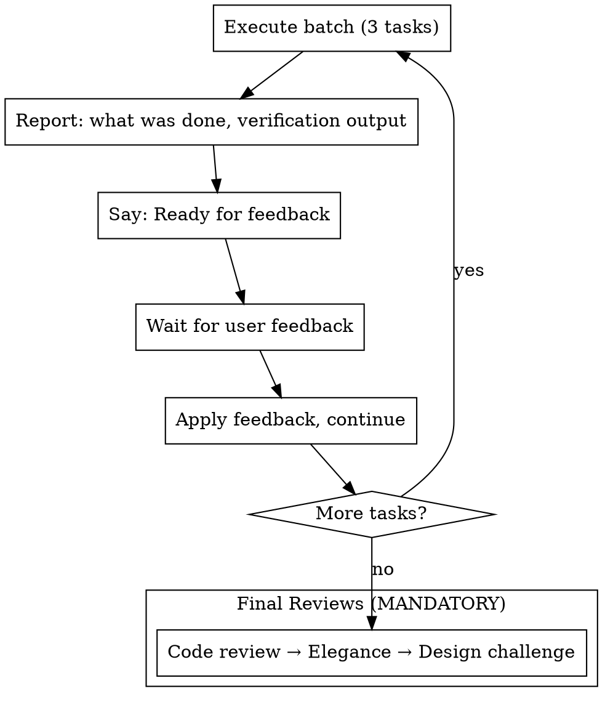
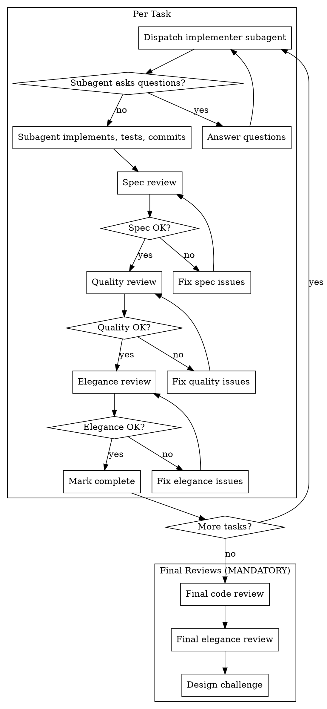

# Executing Plans

Execute implementation plans with configurable execution modes: checkpoint-based (human review between batches) or autonomous (subagent per task with automated reviews).

**Core principle:** One skill, flexible execution - choose the right mode for the situation.

## Step 1: Ask User for Execution Mode

**YOU MUST ask the user which mode they prefer before starting.** Use AskUserQuestion:

```
Question: "How would you like me to execute this plan?"
Header: "Exec mode"
Options:
  - "Checkpoint mode (Recommended)" - "I execute tasks directly, report every 3 tasks for your review"
  - "Autonomous mode" - "Subagent per task with automated spec/quality/elegance reviews, no pause between tasks"
  - "Hybrid mode" - "Subagent execution with checkpoint every N tasks (you specify N)"
```

## Step 2: Load, Review, and Create Full Task List

1. Read plan file
2. Review critically - identify questions or concerns
3. If concerns: Raise them before starting
4. Extract all tasks with full text and context
5. **Create tasks upfront for the ENTIRE execution pipeline using TaskCreate** — not just implementation steps, but every review and checkpoint step. This gives full visibility into what's ahead from the start.

### Task Creation Rules

**YOU MUST create ALL tasks before executing anything.** Use TaskCreate for each item. Set up blockedBy dependencies so tasks form a clear execution chain.

**For Checkpoint Mode**, create tasks in this order:
1. One task per implementation step from the plan (e.g., "Implement: <step title>")
2. One "Checkpoint review" task after every 3rd implementation task (e.g., "Checkpoint: Review batch 1 (steps 1-3)")
3. "Final review: Code review" — blocked by last implementation task
4. "Final review: Elegance review" — blocked by code review task
5. "Final review: Design challenge" — blocked by elegance review task

**For Autonomous Mode**, create tasks in this order:
1. For each plan step, create a group:
   - "Implement: <step title>"
   - "Review: Spec compliance for <step title>" — blocked by its implementation task
   - "Review: Code quality for <step title>" — blocked by spec review
   - "Review: Code elegance for <step title>" — blocked by quality review
2. "Final review: Code review" — blocked by last per-task elegance review
3. "Final review: Elegance review" — blocked by final code review
4. "Final review: Design challenge" — blocked by final elegance review

**For Hybrid Mode**, combine both: per-task review tasks + checkpoint tasks at the user-specified interval.

### Task Naming Conventions

Use prefixes so the task list reads like a roadmap:
- `Implement: ...` — implementation steps
- `Review: ...` — per-task reviews (autonomous/hybrid)
- `Checkpoint: ...` — batch review pauses (checkpoint/hybrid)
- `Final review: ...` — mandatory final reviews

### activeForm Examples

Every task MUST include `activeForm`:
- Implement: "Implementing <step title>"
- Review: "Reviewing spec compliance for <step title>"
- Checkpoint: "Reviewing batch N with user"
- Final review: "Running final code review"

### Example: Checkpoint Mode with 4-Step Plan

Given a plan with steps A, B, C, D, create these tasks in order:

| # | Subject | blockedBy | activeForm |
|---|---------|-----------|------------|
| 1 | Implement: Step A | — | Implementing Step A |
| 2 | Implement: Step B | — | Implementing Step B |
| 3 | Implement: Step C | — | Implementing Step C |
| 4 | Checkpoint: Review batch 1 (steps A-C) | 1, 2, 3 | Reviewing batch 1 with user |
| 5 | Implement: Step D | 4 | Implementing Step D |
| 6 | Checkpoint: Review batch 2 (step D) | 5 | Reviewing batch 2 with user |
| 7 | Final review: Code review | 6 | Running final code review |
| 8 | Final review: Elegance review | 7 | Running final elegance review |
| 9 | Final review: Design challenge | 8 | Running final design challenge |
The user sees the full roadmap from the start. Every step is tracked.

## Step 3: Execute Based on Mode

### Checkpoint Mode (Default)



For each task in batch:
1. Use TaskUpdate to mark the task as `in_progress`
2. Follow steps exactly
3. Run verifications
4. Use TaskUpdate to mark the task as `completed`

**Between batches:** Use TaskUpdate to mark the checkpoint task as `in_progress`. Report what was done and verification output. Say "Ready for feedback." After receiving feedback, mark checkpoint as `completed`.

### Autonomous Mode



**Review order per task:** Spec compliance → Code quality → Code elegance

For each per-task review, use TaskUpdate to mark the corresponding review task as `in_progress` before running it, then `completed` when it passes.

### Final Reviews (MANDATORY after all tasks complete)

**IMMEDIATELY after the last task completes, announce:** "All tasks complete. Starting final reviews."

Then perform these three reviews in order. Mark each final review task as `in_progress` → `completed` using TaskUpdate. No exceptions:

1. **Final Code Review:** Dispatch superpowers:code-reviewer to review all changes against original plan
2. **Final Elegance Review:** Dispatch superpowers:code-elegance-reviewer for cross-file DRY violations (see code-elegance-reviewer-prompt.md)
3. **Design Challenge:** Dispatch superpowers:solution-design-challenger to verify simplest approach (see design-challenger-prompt.md)

Per-task reviews catch local issues. Final reviews catch cross-cutting problems. Skipping final reviews = shipping incomplete work.

| Rationalization | Reality |
|-----------------|---------|
| "Per-task reviews were thorough" | Per-task reviews can't see cross-file patterns |
| "Design was already validated in planning" | Implementation often drifts from plan |
| "No time for final reviews" | Shipping unreviewed code wastes more time |
| "It's just a small change" | Small changes accumulate into big problems |

### Hybrid Mode

Same as autonomous, but pause for user checkpoint every N tasks (user specifies N).

## Prompt Templates (Autonomous/Hybrid)

See supporting files:
- [implementer-prompt.md](implementer-prompt.md)
- [spec-reviewer-prompt.md](spec-reviewer-prompt.md)
- [code-quality-reviewer-prompt.md](code-quality-reviewer-prompt.md)
- [code-elegance-reviewer-prompt.md](code-elegance-reviewer-prompt.md)
- [design-challenger-prompt.md](design-challenger-prompt.md)

## When to Stop

**STOP immediately when:**
- Blocker mid-execution (missing dependency, test fails, unclear instruction)
- Plan has critical gaps
- Verification fails repeatedly

**Ask for clarification. Don't guess.**

## Mode Selection Guide

| Situation | Recommended Mode |
|-----------|------------------|
| First time with this codebase | Checkpoint |
| Complex/risky changes | Checkpoint |
| Well-understood tasks | Autonomous |
| Long plan, trusted patterns | Autonomous |
| Want visibility but less friction | Hybrid (every 5) |

## Red Flags

**Never:**
- Skip the mode selection question
- **Start executing before creating ALL tasks upfront (implementation + reviews + checkpoints + final reviews)**
- Skip per-task reviews in autonomous mode (all three stages required)
- **Skip final reviews after all tasks complete (code review → elegance → design challenge)**
- Proceed with unfixed issues
- Dispatch parallel implementation subagents (conflicts)
- Make subagent read plan file (provide full text)
- Start next review before previous passes
- Mark plan as complete before final reviews pass

**If subagent asks questions:** Answer before they proceed.

**If reviewer finds issues:** Fix → re-review → repeat until approved.
