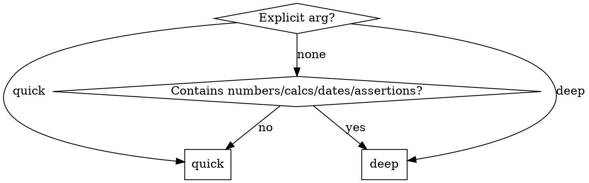

# Verify

## Overview

Fork reviewer subagents to catch errors in claims, logic, and calculations before delivering a response. Always surface issues to the user — never silently fix.

## Mode Selection



**Deep triggers (auto):**
- Digits, %, $, units, dates
- "X is Y", "X equals", "X causes" assertions
- Derived or computed results
- Response > 200 words with factual content

## Quick Mode

Fork one subagent with the draft response. Checklist:

1. Are all factual claims accurate?
2. Is the logic internally consistent?
3. Do any calculations produce the correct result?
4. Are any statements misleading or overstated?

Subagent returns: structured issue list (see Issue Format below).

## Deep Mode

Fork two subagents in parallel:

**Subagent 1 — Fact & Logic Reviewer:**
- Check all factual assertions against known information
- Verify logical consistency throughout
- Flag unsupported or overstated claims

**Subagent 2 — Math & Calculation Verifier:**
- Re-derive every calculation independently from scratch
- Verify units, percentages, totals, dates
- Do NOT reference the original result — derive fresh

Merge findings from both subagents before proceeding.

## Issue Format

Each subagent must return issues in this structure:

```
Issue N: [short label]
Original: "[exact quote from document]"
Problem: [what is wrong and why]
Options:
  A) Fix — [replacement text or specific correction]
  B) Add caveat — [suggested caveat wording]
  C) Remove — [what to remove and why]
  D) No action — [reason it may be acceptable as-is]
```

Always provide all relevant options. Always include a "No action" option when the issue is minor.

## User Selection

After merging all issues, present them as a numbered list with lettered sub-options.

**If `apply` arg was passed**, skip the prompt and auto-apply the recommended fix (option A) for every issue.

**Otherwise**, ask:

> "Which fixes would you like to apply? Enter numbers/letters (e.g. 1A, 2C, 3B), **'all'** to apply all recommended fixes, or 'none' to skip."

The recommended fix per issue is whichever option best corrects the problem (usually A). 'all' applies the recommended fix for every issue.

Wait for the user's response before making any changes.

## Output Format

**If issues found**, present the issue list and user selection prompt BEFORE delivering any corrected content.

**After user selects**, apply only the chosen fixes and deliver the corrected response.

**If no issues**, deliver the response normally with no verification notice.

## Common Mistakes

- **Silently fixing issues** — always surface them; the user needs to know what was wrong
- **Skipping deep mode for "small" numbers** — a wrong percentage is still wrong
- **Math subagent referencing the original result** — it must re-derive independently or it provides no value
